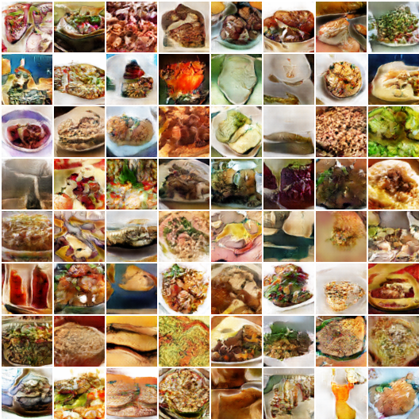
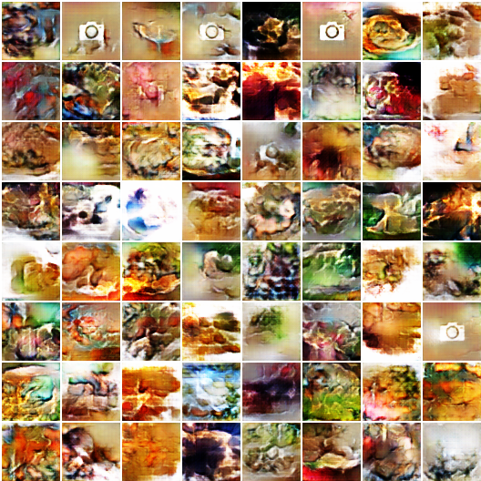
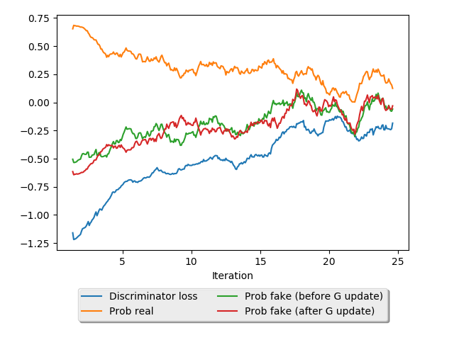

# Food GAN

This repo implements a [Deep Convolutional GAN](https://arxiv.org/abs/1511.06434)(DCGAN) and a [Wasserstein GAN](https://arxiv.org/abs/1701.07875)(WGAN) to generate novel images of food.

## Data
I [scraped](https://github.com/rtlee9/recipe-box) ~125,000 recipes from various websites for use in this model. Each recipe consists of:

* A recipe title
* A list of ingredients
* Preparation instructions
* An image of the prepared recipe (missing for ~40% of recipes collected)

These GANs were fitted on the recipe images; they did not utilize the recipe's title, ingredients list, or instructions.

## Sampled outputs
Below are a few randomly selected outputs from both the DCGAN and the WGAN:

### DCGAN

### WGAN

## Training
Each model was trained for ~4 hours on an nVidia Tesla K80. The loss curve for the WGAN is depicted below:

### WGAN loss curve

## Usage (Python 3.6)

* Clone repo: `git clone https://github.com/rtlee9/food-GAN.git; cd food-GAN`
* Download images from my Google Cloud Bucket: `wget -P imgs https://storage.googleapis.com/recipe-box/imgs.zip; unzip imgs/imgs.zip -d imgs` (alternatively, see the recipe-box submodule to scrape fresh recipe data)
* Remove blacklisted images: `./src/rm_blacklist.sh`
* Train and sample GAN: `python src/pytorch_DCGAN.py --dataset folder --dataroot imgs --outf outputs` or `python src/pytorch_WGAN.py --dataset folder --dataroot imgs --outf outputs`

## Next steps

* Incorporate recipe text (title, ingredients, and instructions) to generate images conditioned on recipe context.
* Filter out placeholder images prior to training
